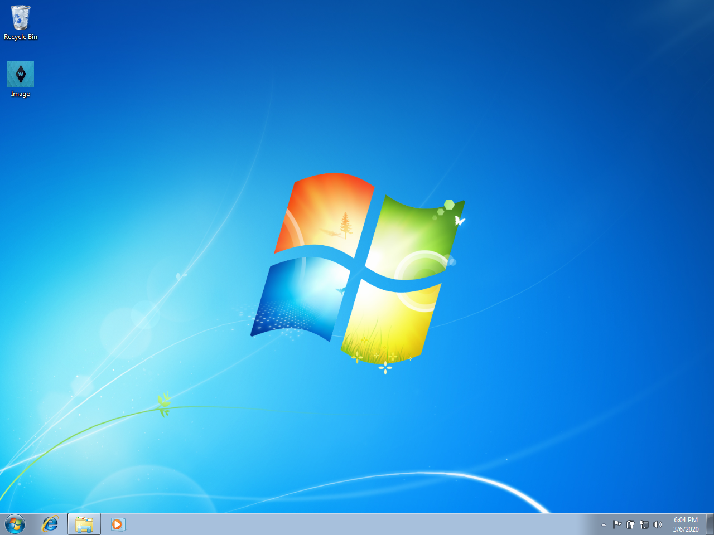
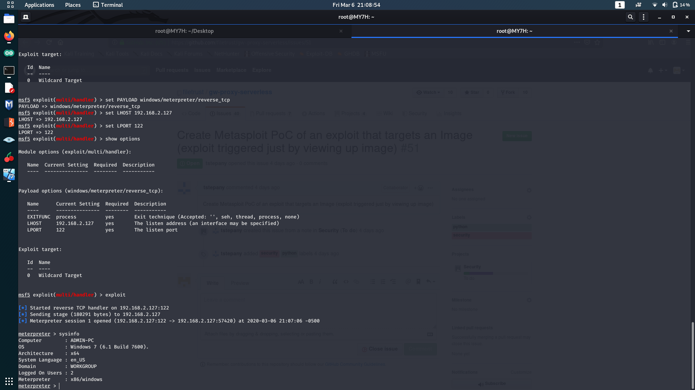

<h1>PreExploitation Phase</h2>  

<h2>Setting up the listener : </h2> 
 

<h2>Sending malicious file to Victim : </h2> 
  

<h1>Exploitation Phase</h2>  

<h2>Victim opens the malicious file : </h2> 
 

<h2>Hacker gets the full control of Victim's PC : </h2> 
  

<h1>Postexploitation Phase</h2>  

<h2>Sending a malicious file to Victim : </h2> 
 

<h2>Victim gets the file automatically : </h2> 
